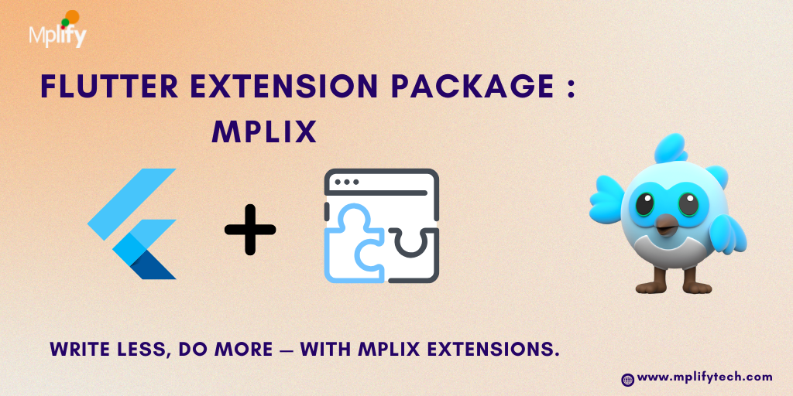

# 🧩 Mplix




**Mplix** is a handy Flutter extension package that enhances your Flutter development experience with powerful, readable, and reusable extensions for `String`, `DateTime`, `BuildContext`, `Color`, `Iterable`, `Widget`, and more — including emoji replacement and utility methods.

> 🚀 Make your Flutter code cleaner, shorter, and more expressive!

---

## ✨ Features

- ✅ `String` extensions – capitalize, title case, convert to number, sentence case, emoji replacements
- ✅ `DateTime` and `Duration` extensions – formatted output, comparison helpers
- ✅ `BuildContext` extensions – screen metrics, theme, snackbar, dialog, navigation, clipboard
- ✅ `Widget` extensions – tap handling, padding, spacing
- ✅ `Color` extension – convert to HEX
- ✅ `Iterable` extensions – `mapIndexed`
- ✅ `Emoji` support – `:pizza: → 🍕`, `:india: → 🇮🇳`, and more!
- ✅ Utility – `log()` for debug printing with optional tags

---

## 🚀 Getting Started

1. Add this to your `pubspec.yaml`:

```yaml
dependencies:
  mplix: ^1.0.0

```
## 📦 Usage

### 📝 String Extensions

```dart
'flutter dev'.capitalize();                          // Flutter dev
'flutter is cool'.toTitleCase();                     // Flutter Is Cool
'hello world. this is flutter.'.capitalizeSentences(); // Hello world. This is flutter.
'123'.toInt();                                       // 123
'12.34'.toDouble();                                  // 12.34
'Flutter ❤️ :pizza: from :india:'.withEmojis();      // Flutter ❤️ 🍕 from 🇮🇳\
```

### 📆 DateTime Extensions

```dart

final now = DateTime.now();

now.format();                                        // 22 Jun 2025
now.short;                                           // 22/06/25
now.time;                                            // 08:30 AM
now.fullDateTime;                                    // 22 Jun 2025, 08:30 AM

now.isToday;                                         // true or false
now.isSameDate(DateTime(2025, 6, 22));               // true

```


### ⏳ Duration Extension
```dart
Duration(seconds: 75).formatted;       // 01:15

```
### 🧱 BuildContext Extensions

```dart
context.width;                         // Screen width
context.height;                        // Screen height

context.theme;                         // ThemeData
context.textTheme.headlineSmall;       // Text style access
context.colorScheme.primary;           // Color access

context.divider;                       // Divider widget
context.spacing(20);                   // SizedBox(height: 20)

context.showSnackbar("Hello!");        // Show snackbar
context.copyToClipboard("Copied!", successMessage: "Text copied"); // Copy to clipboard

context.showLoader(message: "Loading..."); // Show loader
context.hideLoader();                  // Hide loader
```


### 🔁 Navigation Extensions

```dart
context.push(MyNewPage());                  // Push a new page
context.pushReplacement(MyOtherPage());     // Replace current page
context.pop();                               // Go back

await context.withLoadingDialog(
someAsyncFunction(),
message: "Processing..."
); // Show loader while future runs

```

### 📦 Iterable Extension
```dart
['apple', 'banana', 'grape'].mapIndexed((i, val) => '$i: $val');
// Output: ['0: apple', '1: banana', '2: grape']

```

### 🎨 Color Extension

```dart
Colors.blue.toHex();                        // #FF2196F3
Colors.green.toHex(leadingHashSign: false); // FF4CAF50

```

### 🧩 Widget Extensions

```dart
Text('Click Me').onTap(() => print('Tapped!'));           // Tap handler

Container().paddingAll(8);                                // Padding on all sides
Text('Custom').paddingOnly(left: 12, top: 8);             // Specific side padding
Text('Symmetric').paddingSymmetric(horizontal: 16);       // Horizontal/Vertical

```

### 📐 Spacing & EdgeInsets Extensions
```dart
16.spacingY();                     // SizedBox(height: 16)
8.spacingX();                      // SizedBox(width: 8)

12.0.toAll;                        // EdgeInsets.all(12)
10.0.toSymmetric;                 // EdgeInsets.symmetric(horizontal: 10, vertical: 10)

```

### 😀 Emoji Replacement

```dart
'I love :pizza: and :fries:'.withEmojis();        // I love 🍕 and 🍟
'Greetings from :india:'.withEmojis();            // Greetings from 🇮🇳
```

### 📋 Clipboard Utility
```dart
context.copyToClipboard('Secret Key', successMessage: 'Copied to clipboard!');
```

### 🧠 Debug Logging
```dart
'Something went wrong'.log();                     // Logs to debug console
'Page Loaded'.log(tag: 'INIT');                   // [INIT] Page Loaded
```

### 📌 More Coming Soon...
We’re continuously improving Mplix – more utility extensions, emoji packs, and integration widgets are on the way!


